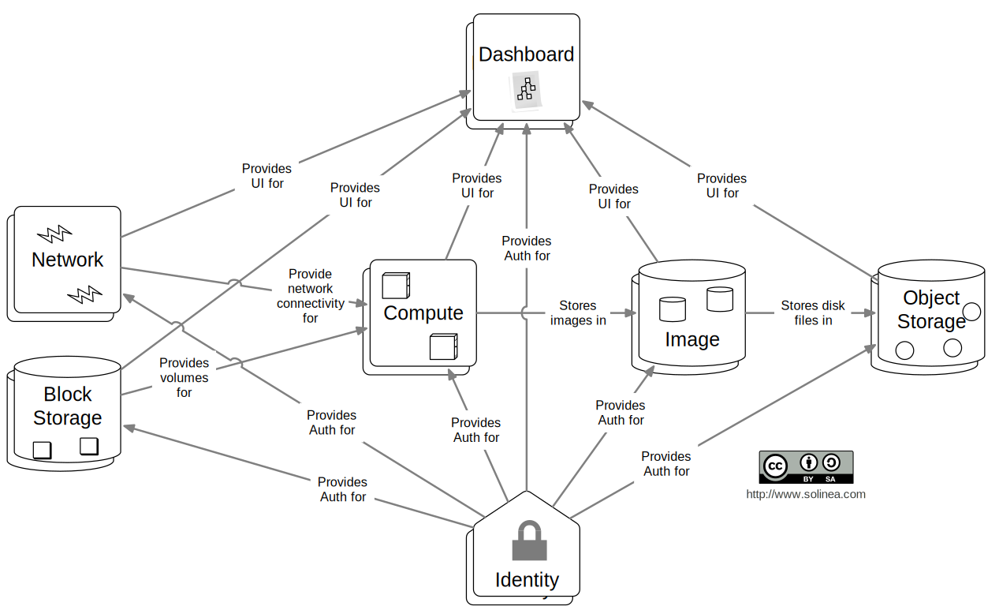
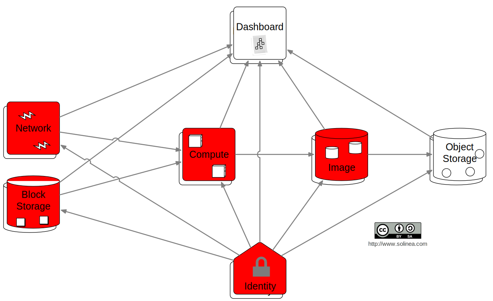

# Why do we want OpenStack high availability?

## Everything's distributed, right?

## Everything's shared nothing, right?

## Any component can always die and we have another, right?

### Well,
# not quite.

Note: This is a *simplified* overview of the OpenStack
architecture. Various components like Heat, Ceilometer, Trove are
omitted for clarity.

Note: Even in this simplified architecture, the **majority** of
services rely on shared infrastructure. In particular:

## AMQP Bus
### RabbitMQ, Qpid
Note: One such example is the Advanced Message Queing Protocol bus,
which OpenStack uses to pass messages between services. These messages
are considered *volatile* and are expected to have an effective life
of 30 seconds or less.

### Can't do without it 
Note: Few OpenStack services can operate without an AMQP exchange they
can talk to. However, the only thing we **really** need to worry about
here in recent OpenStack releases is whether a suitable AMQP service
is alive, not so much what data is in its bus. Because:

### Not stateful
Note: ... the data in AMQP services is not treated as persistent or
stateful by OpenStack services. It's a bit like UDP: if a message is
not delivered, we resend it. Problem solved. That's strikingly
different in another problem domain:

## RDBMS
### MySQL, PostgreSQL
Note: Relational database management systems is where we store
**non-volatile** (persistent) data. This is trickier than the message
bus problem:

### Can't do without it 
Note: Again, most OpenStack services need a backend database.

### Stateful
Note: But this time, the information in them is **inherently**
stateful, meaning we need not only to protect against the loss of
service, but also ensure data persistence across hardware failures.

### What does
# Infrastructure High Availability
### do for us?
Note: This is where infrastructure high availability comes in. It
serves not one, but two purposes.

### Ensure
# service
### availability
Note: We of course need to make sure that our critical services are
running and responsive.

### Ensure 
# data
#### availability
Note: And for stateful services, we **additionally* need to ensure
that they can find their data where they need it. This may or may not
include replication.
